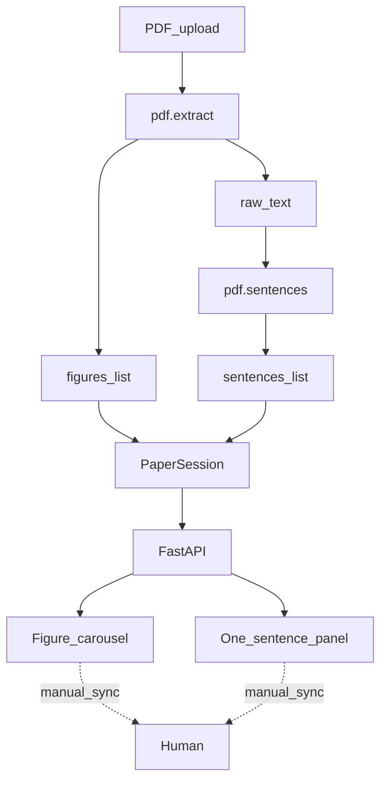

# Architecture

## 목표

PDF → (figures[], sentences[]) → UI.  
UI에서 그림·문장 인덱스는 **독립**으로만 움직인다.



## 디렉터리

```
src/sentence_reading/
  models.py          # Figure, Sentence, PaperSession
  pdf/
    extract.py       # figures + text from PDF (stub)
    sentences.py     # split_into_sentences (stub)
  api/
    app.py           # HTTP + static
  static/
    index.html
    styles.css
    app.js
```

## 모듈 책임

| 모듈 | 책임 | 비책임 |
|------|------|--------|
| `models` | 데이터 형태·인덱스 불변조건 문서화 | I/O, UI |
| `pdf.extract` | PDF 바이트 → 그림 바이너리/메타 + 원문 텍스트 | 문장 분할, HTTP |
| `pdf.sentences` | 원문 → 문장 리스트 | PDF 파싱 |
| `api.app` | 라우팅, 정적 파일, ingest 자리 | 비즈니스 로직 본문 |
| `static/*` | 표시·네비·타이포 | PDF 알고리즘 |

## API (스켈레톤)

| Method | Path | 동작 |
|--------|------|------|
| GET | `/` | `index.html` |
| GET | `/api/status` | `{ ok, stage: "skeleton", pdf_extract: false }` |
| GET | `/api/session/mock` | mock figures + sentences (UI 데모) |
| POST | `/api/ingest` | stub → 501 또는 “not implemented” JSON |

## PaperSession 불변조건

- `figure_index ∈ [0, len(figures))` (비어 있으면 UI가 empty 상태)
- `sentence_index ∈ [0, len(sentences))`
- `advance_figure(±1)` 는 `sentence_index`를 바꾸지 않는다
- `advance_sentence(±1)` 는 `figure_index`를 바꾸지 않는다

이 불변조건이 깨지면 제품 가설(수동 동기화)이 깨진다.

## 다음 구현 순서

세부는 **[design/](design/README.md)** 가 권위 문서다. 요약:

1. M1 — 데이터/API 계약 ([design/01](design/01-data-model.md), [04](design/04-api-contract.md), [05](design/05-session-store.md))
2. M2 — 텍스트 추출 + 문장 분할 ([02](design/02-pdf-extract.md), [03](design/03-sentence-split.md))
3. M3 — 그림 추출 + `/media`
4. M4 — UI 상태·업로드 연결 ([06](design/06-ui-states.md))
5. M5 — 진행 저장·타이포 조절 (선택)

에러·한도·테스트: [08](design/08-errors.md) · [09](design/09-testing.md) · [10](design/10-security-limits.md)
