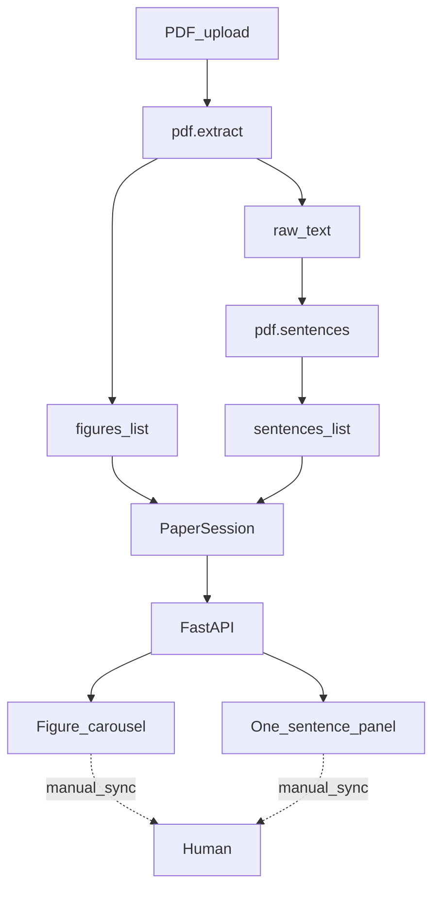

# Architecture

## 목표

PDF → (figures[], sentences[]) → UI.  
UI에서 그림·문장 인덱스는 **독립**으로만 움직인다.


```mermaid
flowchart TB
  pdf[PDF_upload] --> extract[pdf.extract]
  extract --> figs[figures_list]
  extract --> text[raw_text]
  text --> split[pdf.sentences]
  split --> sents[sentences_list]
  figs --> session[PaperSession]
  sents --> session
  session --> api[FastAPI]
  api --> uiTop[Figure_carousel]
  api --> uiBot[One_sentence_panel]
  uiTop -.->|manual_sync| human[Human]
  uiBot -.->|manual_sync| human
```

## 디렉터리

```
src/sentence_reading/
  models.py
  pdf/
  llm/
    translate.py     # 영→한 단순·다단계 (design/35–36)
    tts_speak.py     # TTS
  stt/
    compare.py       # 원문 vs 인식 단어 diff · 점수 없음 (design/37)
    recognize.py     # 오디오 → 영어 전사 Gemini (design/38)
  api/
    app.py           # HTTP + static
  static/
    index.html
    styles.css
    app.js
    stt_practice.js  # MediaRecorder 서버 STT + Web Speech 폴백
```

## 모듈 책임

| 모듈 | 책임 | 비책임 |
|------|------|--------|
| `models` | 데이터 형태·인덱스 불변조건 문서화 | I/O, UI |
| `pdf.extract` | PDF 바이트 → 그림 바이너리/메타 + 원문 텍스트 | 문장 분할, HTTP |
| `pdf.sentences` | 원문 → 문장 리스트 | PDF 파싱 |
| `llm.translate` | 한 문장 영→한 (simple · pipeline draft/sense/polish) | 용어집 DB, TTS |
| `llm.translate_section` | ingest 시 섹션 pipeline → digest → harmonize · 캡션 | 실시간 스트리밍 번역 |
| `cite_refs` | 본문 `[n]` ↔ References · DOI 문자열 | 이름-연도 인용 전체 |
| `llm.crossref_resolve` | 문헌 → DOI/Crossref/Scholar URL | 출판사별 검색 완전 매핑 |
| `stt.compare` | 기대/인식 토큰 diff | 점수·마이크 |
| `stt.recognize` | 짧은 오디오 → 영어 전사 | 채점·장기 보관 |
| `api.app` | 라우팅, 정적 파일, ingest | 비즈니스 로직 본문 |
| `static/*` | 표시·네비·타이포·번역·STT 연습 | PDF 알고리즘 |

## API (발췌)

| Method | Path | 동작 |
|--------|------|------|
| GET | `/` | `index.html` |
| GET | `/api/status` | 버전·기능 플래그 (`cite_ref_open` · `translate_ingest_sections` 등) |
| POST | `/api/translate` | `{ text, mode? }` → `{ ok, ko, stages_done }` (0.2.44 · design/35–36) |
| POST | `/api/cite/resolve` | `{ text }` → `{ ok, url, doi?, source }` (0.2.49 · design/41) |
| POST | `/api/stt/compare` | `{ expected, heard }` → `{ ok, diff }` · **score 없음** (0.2.45 · design/37) |
| POST | `/api/stt/recognize` | multipart 오디오 → `{ ok, heard, compare? }` (0.2.46 · design/38) |
| UI | 번역 on | EN\|KO 좌우 · **ingest KO만** (0.2.50 · design/42 · live 폴백 없음) |
| ingest | 번역 | 섹션 `text_ko` · `caption_ko` · `translate_digests` (0.2.48 · design/40) · 캐시 히트 시 백필 (0.2.50) · 진행 세분 (0.2.51 · design/43) · progressive 열기 (0.2.53 · design/45) · 병렬 (0.2.54 · design/46) |
| 클라이언트 | Android | `mobile/` + `android/` + 이메일·보관 (0.2.55–0.2.56 · 0.2.69–0.2.79 · design/33·47·48·61·62) · Live Enable/IPS 없음 |
| UI | 각주 | 칩·원문 열기 (0.2.49) · 박스 [n] 숨김 · FS hover (0.2.57 · design/49) |
| UI | 번역 KO | 어절 줄바꿈 keep-all (0.2.58 · design/50) |
| UI | 되새김질 | 구간 노트 이어 보기 (0.2.59 · design/51) · 목소리 이어 듣기 (0.2.60 · design/52) · on/off (0.2.61 · design/53) · 클립 재듣기/재녹음 (0.2.62 · design/54) · flow 콕 수정 (0.2.63 · design/55) · 키보드 (0.2.64 · design/56) · 흰 십자 (0.2.65 · design/57) |
| UI | 헤더 | 「파일 열기」+ `⋯` (0.2.66 · design/58) · Guide 밖/`⋯` 안 (0.2.67 · design/59) · 패널 hint 기본 숨김 (0.2.79 · design/60) · Live Enable/IPS 없음 (Trading Gate) |
| UI | 각주 | `[n]` 칩 · References 패널 · 원문 열기 (0.2.49 · design/41) |
| GET | `/api/session/mock` | mock figures + sentences |
| POST | `/api/ingest` | 논문 분석 잡 (Gemini 있으면 섹션 번역 · References 추출) |

## PaperSession 불변조건

- `figure_index ∈ [0, len(figures))` (비어 있으면 UI가 empty 상태)
- `sentence_index ∈ [0, len(sentences))`
- `advance_figure(±1)` 는 `sentence_index`를 바꾸지 않는다
- `advance_sentence(±1)` 는 `figure_index`를 바꾸지 않는다
- 번역 on/off·STT 연습·각주 패널은 읽기 인덱스를 바꾸지 않는다 (번역 기본 off)

이 불변조건이 깨지면 제품 가설(수동 동기화)이 깨진다.

## 배포 · CI/CD (0.2.33)

| 경로 | 역할 |
|------|------|
| 로컬 `127.0.0.1:8770` | 개발 문지기 |
| Cloud Run | PC 꺼도 동일 API · GCS 창고 ([design/25](design/25-cloud-run.md)) |
| `.github/workflows/ci.yml` | PR·`main` 마다 pytest (**항상**) |
| `.github/workflows/deploy-cloud-run.yml` | Cloud Run 재배포 (**기본 off**) |

CD를 켜려면 GitHub repository variable `ASR_CD_ENABLED=1` 과 Secrets(`GCP_SA_KEY`, `ASR_GOOGLE_CLIENT_ID`, `ASR_AUTH_SECRET`, `GEMINI_API_KEY`) — 상세 [design/32](design/32-github-cd.md).  
이미지·레포에 SA JSON·API 키를 넣지 않는다. 런타임은 Cloud Run ADC.

## 구현 순서 (권위: design/)

세부는 **[design/](design/README.md)** 가 권위 문서다. 번역은 ingest 전용(42)·각주 원문(41)까지 반영.  
다음: Google/카카오 · 실기 APK (TTS 0.2.79 완료).

에러·한도·테스트: [08](design/08-errors.md) · [09](design/09-testing.md) · [10](design/10-security-limits.md)
