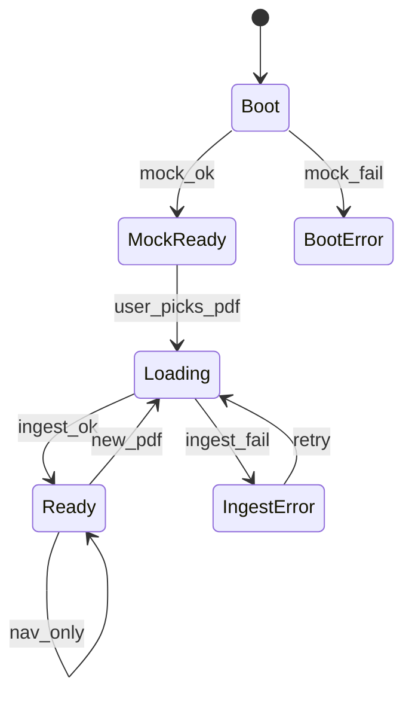

# 06 — UI states

프론트 상태머신. `app.js`가 단일 `uiPhase`를 가진다.

## Phases

| Phase | 화면 |
|-------|------|
| `Boot` | 배지 “loading…” |
| `MockReady` | mock 데이터, 배지 skeleton/mock (현재) |
| `BootError` | 문장 패널에 실패 메시지 |
| `Loading` | 네비 버튼 disabled, “추출 중…” |
| `Ready` | 실세션, 배지에 파일명 |
| `IngestError` | 에러 메시지 + 재시도 |

## Empty 서브상태 (Ready 안)

| 조건 | 그림 영역 | 문장 영역 |
|------|-----------|-----------|
| figures=0, sentences>0 | “그림 없음 (embedded 없음)” | 정상 네비 |
| figures>0, sentences=0 | 정상 | “문장 없음 — 스캔본?” |
| 둘 다 0 | 둘 다 empty 안내 | |

빈 쪽 화살표는 no-op (이미 코드와 동일).

## 네비 규칙 (재확인)

| 키 | phase Ready/MockReady | 그 외 |
|----|----------------------|-------|
| ←/→ | 문장 | 무시 |
| Shift+←/→ | 그림 | 무시 |
| input focus | 무시 | — |

## 업로드 UI (M4)

- `<input type="file" accept="application/pdf,.pdf">`
- 선택 즉시 Loading → ingest
- 드래그앤드롭은 M4 보너스 (필수는 파일 버튼)

## 표시 디테일

- `Fig i / N`, `Sent j / M` — N=0이면 `—`
- caption 없으면 figcaption 숨김(빈 문자열이면 요소 `hidden`)
- 긴 문장: 패널 스크롤 허용, 폰트 축소 자동은 **하지 않음** (Immersive 토큰 유지)

## 그림 접기 (레이아웃만)

`expanded` | `collapsed` 는 **uiPhase와 직교**한다. Ready/MockReady 어느 쪽이든 스플리터로 접을 수 있다.  
인덱스는 그대로. 상세: [11-figure-collapse.md](11-figure-collapse.md)
