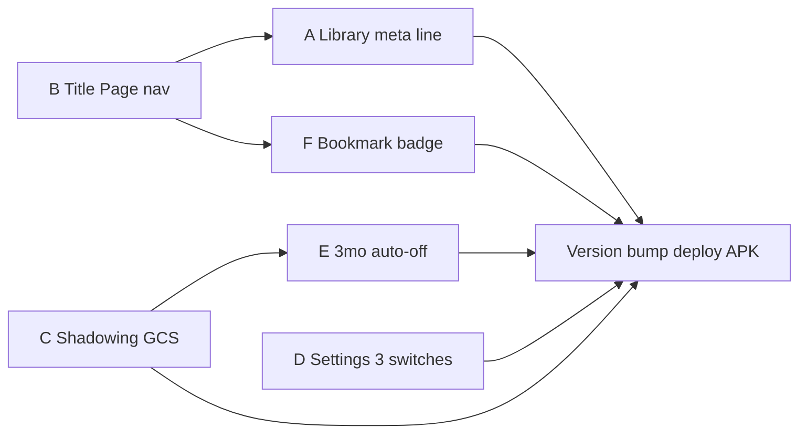

# 160 — Mobile library · reader polish bundle

Modules: `library_screen.dart` · `paper_models.dart` · `reader_nav_labels.dart` · `settings_screen.dart` · `shadowing_controller.dart` · `app.py` (shadowing build) · `extract.py` (optional slot_key)  
받침: [18](18-paper-library.md) · [135](135-cover-as-figure.md) · [144](144-paper-retention-ttl.md) · [79](79-shadowing-opt-in.md) · [80](80-shadowing-chunks.md) · [121](121-library-open-gcs-first.md) · [148](148-mobile-cite-panel.md)

## 무엇인가

2026-08-31 폰 QA·대화에서 잠긴 **모바일+서버 묶음 칩**. ACS plain cite **0.3.93** 은 별도 완료 — 본 문서 범위 밖.

| # | 항목 | 한 줄 |
|---|------|--------|
| A | 보관 행 메타 | `문장 N · 그림 N` + `보관` / `만료` / `읽기` 시각 |
| B | Title Page 네비 | 표지 ≠ Figure · `Title Page` / `Figure` / `Table` |
| C | 연습 GCS pull | shadowing build가 `/open`처럼 GCS 먼저 |
| D | 설정 3스위치 | 설명 제거 · 「따라 말하기 연습」 |
| E | 연습 3개월 auto-off | 미사용 시 OFF · 읽기 「연습」 숨김 |
| F | 보관 북마크 배지 | 「메인」 칩 왼쪽 총 북마크 수 |

## Product (locked)

### A — 보관 목록 (`library_screen`)

**Before**

```
[제목]                         [메인]
메인 · 문장 93 · 그림 12
2026-08-30T15:10:06.145733+00:00
```

**After**

```
[제목]                         [메인]   ← 메인 칩만 (배지 F)
문장 93 · 그림 10
보관: 8/31 00:10 (11/29 00:10 만료)  읽기: 8/31 00:40
```

| 필드 | 소스 | 규칙 |
|------|------|------|
| 문장 N | `sentence_count` | >0 일 때만 |
| 그림 N | `figure_count` **또는** nav 파생 | **Title Page 제외** (B와 동일 정의) |
| 보관: | `updated_at` | ISO → **로컬(KST) `M/d HH:mm`** |
| ( … 만료) | `expires_at` | 동일 포맷 + `만료` · TTL 꺼짐이면 괄호 생략 |
| 읽기: | `last_read_left_at` | **읽기 탭을 떠난 시각** · uid+`cache_id` prefs |

**읽기 시각 갱신 (locked)**

- 보관 탭·설정 탭으로 **하단 네비 전환** (읽기 → 다른 탭)
- `AppLifecycleState.paused` / `inactive` (백그라운드)
- **갱신 안 함:** 읽기 탭에 머무는 동안 문장만 넘김

**subtitle에서 제거:** `libraryTag`(메인) · raw ISO · `stale`/`삭제 N일 전`은 ⚠️ 아이콘(기존) 유지

### B — Title Page / Figure / Table (`FigureNavIndex`)

- design/135 표지 슬롯은 **유지** (캐러셀 index 0)
- 네비 종류: `title_page` · `figure` · `table` · `figure_s` · `table_s` (보충은 기존)
- 헤더 예: `Title Page` `1 / 1` · `Figure` `2 / 10` (표지는 Figure 번호에 **미포함**)
- 북마크 키: `title_page:1` · picker 왼쪽 휠에 Title Page 종류
- 서버 `figure_count`(목록 API): **선택** — `title_page` 슬롯 제외한 figure 슬롯 수로 정렬 (재분석 후 일치)

**인식 (fail-closed)**

1. `caption` case-insensitive `title page` prefix → `title_page:1`
2. (선택) ingest `slot_key=title_page:1` on `_maybe_title_cover_figure`

### C — Shadowing build GCS-first (`app.py`)

- `POST /api/shadowing/chunks/{id}/build` 에서 `rows` 없을 때:
  1. `refresh_paper_for_open(cache_id)` 또는 동등 `download_paper_cache` (**design/121**)
  2. 실패 → `502` / `gcs_pull_failed` · 메시지 **보관 실패 아님**
  3. 성공 후 `load_cached_session`
- 응답 `message`: `보관된 논문을 찾을 수 없습니다` **금지** (연습 전용 문구)
- **SoT = 클라우드** — 폰 `sentences` payload는 필수 아님 (옵션 최적화만)

### D — 설정 3스위치 (`settings_screen`)

설명 문단·섹션 제목 제거. 스위치만:

| 라벨 | 기존 |
|------|------|
| 번역 | 번역 사용 |
| 참고문헌 패널 표시 | 동일 |
| 따라 말하기 연습 | 쉐도잉 연습 사용 |

서버 kill 시: 스위치 `onChanged: null` (기존과 동일) · 긴 설명 대신 짧은 `error` 한 줄만 허용.

### E — 따라 말하기 3개월 auto-off

| 조건 | 동작 |
|------|------|
| `enabled==true` && `now - last_practice_pressed_at > 90d` | `enabled=false` (자동) |
| `last_practice_pressed_at` 없음 && `enabled_since` > 90d 전 | 동일 (한 번도 연습 버튼 안 누름) |
| `enabled==false` | 읽기 상단 **「연습」** 버튼 숨김 |
| 사용자 | 설정에서 **언제든 다시 ON** |

**기록**

- `last_practice_pressed_at` — 읽기 「연습」 탭 진입/시작 시 갱신 (uid prefs)
- `enabled_since` — 사용자가 ON으로 바꾼 시각 (auto-off 리셋용)
- **UI 설명 없음** (locked)

**검사 시점:** `bindUid` · 설정 화면 `build` · `HomeShell` resume · 읽기 탭 진입 전

### F — 보관 북마크 배지

- `BookmarkController.paperBookmarkCount(cacheId)` — 문장+그림 active 북마크 합
- 「메인」 Chip **왼쪽** · `Badge` (읽기 `ReaderNavHeaderLabel`와 동일 위젯)
- 0이면 배지 숨김

**상태:** 워킹트리에 부분 구현 (`bookmark_models` · `bookmark_controller` · `library_screen` · `home_shell`) — 본 칩에 커밋·APK 포함.

---

## 구현 체크리스트 (파일별)

### 서버 — Python

| 파일 | 변경 |
|------|------|
| `src/sentence_reading/api/app.py` | `shadowing_chunks_build`: GCS pull + 오류 메시지 |
| `src/sentence_reading/pdf/extract.py` | (선택) cover `slot_key=title_page:1` |
| `src/sentence_reading/cache/paper_cache.py` | (선택) list `figure_count` = non-title slots |
| `tests/test_shadowing_chunks_build_failclosed.py` | GCS miss / pull mock |
| `tests/test_shadowing_opt_in.py` | 버전 핀 |
| `tests/test_cover_as_figure.py` | title_page slot · count |

### 모바일 — Dart

| 파일 | 변경 |
|------|------|
| `mobile/lib/api/reader_nav_labels.dart` | `title_page` kind · header/picker/bookmark |
| `mobile/lib/api/paper_models.dart` | `subtitle` 제거/대체 · `metaLine` · `timingLine` · 날짜 포맷 |
| `mobile/lib/api/read_progress_store.dart` (또는 신규 `read_left_store.dart`) | `last_read_left_at` read/write |
| `mobile/lib/screens/library_screen.dart` | 2줄 메타 · 배지 F · ISO 제거 |
| `mobile/lib/screens/home_shell.dart` | 탭 전환 시 `recordReadLeft` · 배지 listenable |
| `mobile/lib/screens/reader_screen.dart` | `shadowing.enabled` → 연습 버튼 hide · practice pressed |
| `mobile/lib/screens/settings_screen.dart` | D 3스위치 |
| `mobile/lib/state/shadowing_controller.dart` | E auto-off · `enabled_since` · `recordPracticePressed` |
| `mobile/lib/api/shadowing_store.dart` | prefs 키 확장 |
| `mobile/lib/state/bookmark_controller.dart` | F `paperBookmarkCount` (있음) |
| `mobile/lib/api/bookmark_models.dart` | `totalActiveCount` (있음) |
| `mobile/test/reader_nav_labels_test.dart` | title_page nav |
| `mobile/test/paper_models_test.dart` | meta/timing lines |
| `mobile/test/bookmark_models_test.dart` | (있음) |
| `mobile/test/shadowing_auto_off_test.dart` | 90d 경계 |

### 버전 · 배포

| 파일 | bump |
|------|------|
| `src/sentence_reading/api/app.py` | `version` ×2 |
| `mobile/pubspec.yaml` | `0.3.94+1` (예) |
| `mobile/lib/config.dart` | `kAppVersionLabel` |
| shadowing version tests | 동일 |

`python scripts/pre_deploy_guard.py` → deploy → `verify_live_status.py --expect <ver>` → **APK** (`flutter build apk` + `adb install -r`).

---

## 권장 구현 순서



1. **B** — 네비·그림 개수 정의 (A의 `그림 10` 의존)
2. **A** — 보관 메타 + 읽기 이탈 시각
3. **C** — 연습 배너 버그 (서버만으로도 체감 개선)
4. **D** + **E** — 설정·연습 정책
5. **F** — 배지 (코드 머지)
6. 배포

---

## 테스트 계획

### 자동

- [ ] `pytest` shadowing build + cover/title_page
- [ ] `flutter test` nav · paper_models · shadowing_auto_off · bookmark

### 폰 E2E (SM-G986N)

- [ ] 보관 행: 메타 2줄 · ISO 없음 · 만료 괄호
- [ ] 읽기 → 보관 전환 후 `읽기:` 갱신
- [ ] Title Page `1/1` · Figure `1/10` · 오른쪽 한 번에 `Figure 2/10`
- [ ] 연습 ON + 논문 열기 → **빨간 보관 오류 배너 없음**
- [ ] 연습 OFF → 읽기 「연습」 숨김
- [ ] (시간 mock) 90d 미연습 → 자동 OFF
- [ ] 메인 왼쪽 북마크 배지

---

## 비목표 (이번 칩)

- 웹 보관 UI 메타 줄 (모바일만)
- ingest 시 plain cite → sup 정규화 (0.3.93 별도)
- Cloud Scheduler TTL purge 배치 (144 후보)
- 연습 auto-off **설정 화면 설명** 문구

---

## Version (target)

**0.3.94** (또는 live+1 at ship time) · pipeline unchanged unless B touches extract slot_key.

## 선행 완료

- **0.3.93** ACS plain trailing cite · TTS strip order · `cite_refs` 3-way sync · APK
