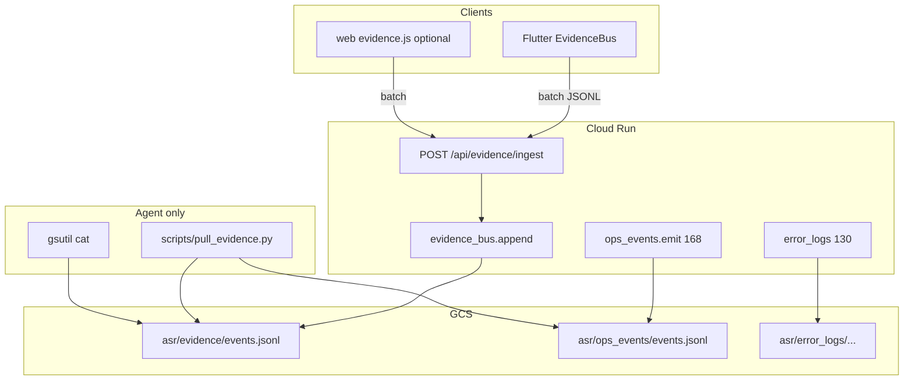

# 169 — Agent Evidence Bus (전역 증거 수집 · UI 없음)

**Version:** (구현 시 bump — 예: 0.3.122+)  
**Depends:** [08](08-errors.md) · [10](10-security-limits.md) · [130](130-cloud-error-logs.md) · [168](168-ingest-observability.md) · [168-audit-checklist.md](168-audit-checklist.md)  
**Companion:** [169-audit-checklist.md](169-audit-checklist.md) (파일·함수 단위 전수표)  
**Blocks:** 「처리에 실패했습니다」류 **원인 불명 버그 수정 루프** (증거 없이 패치 금지)

---

## 0. 한 줄 요약

사용자가 앱·웹·API에서 하는 **거의 모든 의미 있는 행위**와 **모든 실패·조용한 실패·불일치**를  
**구조화 JSONL**로 GCS에만 쌓는다.  
**관리자 UI 없음 · 사용자 UI 없음 · 배지 없음 · 설정 화면 없음.**  
소비자 = **Cursor 에이전트 / 로컬 스크립트 / gsutil** 뿐.  
목적 = **오류 개선** (제품 대시보드·알림·상호 감시 아님).

---

## 1. 왜 168/130만으로는 부족한가 (locked 교훈 · 2026-09-01)

| 층 | 있었던 것 | Co–TiO₂ 재분석에서 겪은 구멍 |
|----|-----------|------------------------------|
| 168 `ops_events` | ingest phase · stall · reclaim | **폰에서 `translate=0`으로 나간 순간**, Settings 토글 ON과의 불일치가 이벤트에 없음 |
| 130 `error_logs` | Flutter 예외 · hang · **관리자 배지 UI** | 일반 실패(`AsrApiException` 422)는 snackbar만 → **job_id·서버 message가 디스크에 안 남음** |
| 에이전트 | gsutil로 JSONL 수동 pull | 로컬 ADC 없으면 `download_bytes` 실패 → **증거가 “없는 것처럼” 보임** |
| UI | 「처리에 실패했습니다」 | 서버는 `번역 진행이 멈춘 것 같습니다`였는데 **표면 문구가 소실** |

**교훈:** ingest 경계만 계측하면, **클라 결정(토글·prefs·auth blip)·open/window·설정** 이 빠져 **같은 버그를 버전마다 추측 패치**하게 된다.

---

## 2. Product (locked)

| # | Rule | Detail |
|---|------|--------|
| P1 | **오류 개선 전용** | 제품 KPI·사용량·마케팅 이벤트 금지. kind는 실패·경계·결정·불일치만. |
| P2 | **UI 제로** | 사용자 화면·관리자 설정·배지·이메일·푸시 **신규 UI 금지**. 기존 130 admin 오류 로그 화면은 **유지하되 169 버스에 연결하지 않음** (병행, 혼합 금지). |
| P3 | **전역 상관** | 세션마다 `trace_id`(또는 `client_run_id`) 하나. 이후 open/reanalyze/poll/window가 같은 id를 이어받거나 `parent_trace_id`로 링크. |
| P4 | **실패≠침묵** | `except: pass` / empty catch / “실패했는데 ok처럼 보이는” 경로 → **evidence emit 필수** (168 silent catch 규칙 확장). |
| P5 | **본문 금지** | 논문 문장·캡션 전문·PDF bytes·토큰·비밀번호·이메일 전문 **금지**. cache_id · job_id · percent · enum · 길이·건수만. |
| P6 | **쓰기만 / 읽기는 에이전트** | 런타임은 append-only. **조회 HTTP API 신규 금지** (admin GET 도 169 범위 밖). 읽기 = `scripts/pull_evidence.py` + gsutil. |
| P7 | **제품 동작 불변** | 169a는 **계측만**. 실패를 숨기거나 성공으로 바꾸지 않음. |
| P8 | **168과 공존** | 서버 ingest 이벤트는 기존 `ops_events.emit` 유지. 169는 **클라 breadcrumb + 서버 비-ingest 경계 + 에이전트 pull UX**를 채움. 중복 kind는 `source` 필드로 구분. |
| P9 | **킬 스위치** | `ASR_EVIDENCE_BUS=0` → 서버 sink no-op. 모바일 `ASR`/status flag `evidence_bus=false` → 클라 전송 중단. |
| P10 | **비용 상한** | 유저당·분당 rate limit. 동일 kind+stage 중복은 샘플링(첫 N + 1/M). |

### 명시적 비목표

- Datadog / Sentry / Prometheus
- 관리자 대시보드 · 사용자 “진단 보내기” 버튼
- 자동 수리(merge) · 자동 재시도 정책 변경 (별도 칩)
- 논문 원문 검색용 로그

---

## 3. 저장 위치 · 스키마

### 3.1 GCS 객체 (공유 warehouse · uid 칸 아님)

기존 168과 **같은 버킷**, **다른 prefix**:

| 경로 | 내용 |
|------|------|
| `asr/ops_events/events.jsonl` | **168** (서버 ingest/open figures) — 유지 |
| `asr/evidence/events.jsonl` | **169** 전역 버스 (클라+서버 non-UI) — **신규** |
| `asr/error_logs/…` | **130** 관리자용 — 유지, 169와 merge 금지 |

WHY 분리: 130은 admin UI가 읽고, 169는 **에이전트만** 읽는다. 스키마·retention·redact 정책을 다르게 가져갈 수 있음.

### 3.2 로컬 폴백

| 환경 | 경로 |
|------|------|
| 서버 | `data/evidence/events.jsonl` (`project_root()`) |
| 모바일 (옵션) | app documents `evidence_ring.jsonl` (최근 200줄) — **업로드 실패 시만** 링버퍼; 성공 시 서버로 flush |

### 3.3 이벤트 JSON (한 줄 = 한 이벤트)

```json
{
  "id": "ev_0123456789abcdef",
  "ts": "2026-09-01T07:03:53Z",
  "schema_v": 1,
  "source": "mobile",
  "kind": "client_api_fail",
  "severity": "error",
  "trace_id": "tr_ab12cd34ef56",
  "parent_trace_id": "",
  "job_id": "job_17768c6a22c9",
  "cache_id": "1c4c2b8a1e28",
  "session_id": "ses_…",
  "owner_uid": "u…",
  "content_hash": "",
  "deploy_git_sha": "a06f40fa…",
  "app_version": "0.3.121",
  "pipeline_version": "rich-v24",
  "route": "POST /api/cache/papers/{id}/reanalyze",
  "stage": "poll_done",
  "percent": 90,
  "http_status": 422,
  "ok": false,
  "code": "ingest_failed",
  "message": "번역 진행이 멈춘 것 같습니다. 다시 시도해 주세요.",
  "details": {
    "want_translate_pref": true,
    "want_translate_sent": false,
    "figure_index": 3,
    "figure_count": 7,
    "image_src_empty": true,
    "idle_sec": 302
  }
}
```

### 3.4 필드 규약

| 필드 | 규칙 |
|------|------|
| `source` | `mobile` \| `web` \| `server` \| `agent` |
| `severity` | `lifecycle` \| `decision` \| `boundary` \| `error` \| `consistency` \| `sample` |
| `kind` | allowlist만 (`evidence_kinds.py` / Dart const). 미등록 → **drop + local counter** |
| `message` | `redact_text` · max 200자. 한글 사용자 문구 OK (증거용). 토큰/경로 금지 |
| `details` | **확장 `_safe_details`**: bool · int · float · `^[a-z][a-z0-9_]{0,63}$` 문자열 · **추가로** `want_translate_pref` 같은 snake 키. **대문자 CamelCase 타입명 금지** → `exc_type`로 snake 변환 |
| `ok` | 성공 경계면 true, 실패면 false. lifecycle 시작은 생략 가능 |
| `app_version` | 모바일 `0.3.x` / 서버 status version |

### 3.5 kind allowlist (초기 · 확장 시 체크리스트에 행 추가)

#### A. lifecycle / decision (샘플링 가능)

| kind | 언제 |
|------|------|
| `client_session_start` | 앱 cold start · 로그인 성공 |
| `client_session_end` | logout · clearAll |
| `pref_translate_set` | Settings 번역 스위치 변경 |
| `pref_translate_read` | ingest/reanalyze/open 직전 prefs 읽은 값 |
| `pref_shadowing_set` | 쉐도잉 스위치 |
| `nav_tab` | 보관/읽기/설정 탭 (sample) |
| `reader_open` | `LibraryController.open` 시작/성공/실패 |
| `reader_cursor` | sentence/figure index 변경 (sample 1/20) |
| `figure_window_req` | window API 호출 |
| `figure_window_res` | 응답: empty count / miss |
| `ingest_upload_start` | chunked/multipart 시작 |
| `ingest_poll_tick` | percent/message 변경 시만 |
| `reanalyze_start` | `startReanalyze` 직전/직후 |
| `reanalyze_pref_snapshot` | **필수** want_translate_pref · sent query · uid 유무 |

#### B. error / consistency (전부 기록 · 샘플링 없음)

| kind | 언제 |
|------|------|
| `client_api_fail` | `AsrApiException` (4xx/5xx) |
| `client_api_timeout` | timeout |
| `client_unhandled` | FlutterError / platform |
| `client_hang` | HangWatchdog |
| `client_silent_catch` | 의도적 catch에서 report (168d 확장) |
| `translate_poll_exhausted` | 기존 mobile report 유지 → evidence에도 mirror |
| `server_handler_fail` | FastAPI unhandled → middleware |
| `server_job_terminal_error` | job `error` set (168 `ingest_terminal`와 병행 emit) |
| `consistency_violation` | 168b mirror into evidence **optional** (또는 ops만) |
| `figure_preserve_miss` | reanalyze save 시 prior_fig_bytes=0 & force_cache_id set |
| `stall_skipped_live_worker` | stall 탐지가 local_running 때문에 skip (sample) |
| `stall_fired` | translate_stalled (ops + evidence) |

---

## 4. 아키텍처



**중요:** `POST /api/evidence/ingest` 는 **쓰기 전용**.  
`GET` list/admin **만들지 않음** (P2 · P6).

---

## 5. 모듈 · 파일 설계 (구현 단위)

### 5.1 서버 신규

| 파일 | 역할 |
|------|------|
| `src/sentence_reading/llm/evidence_bus.py` | **신규** schema_v=1 · allowlist · redact · append GCS/local · rate limit · kill |
| `src/sentence_reading/llm/evidence_kinds.py` | **신규** `ALLOWED_KINDS` frozenset (ops와 분리) |
| `src/sentence_reading/api/app.py` | `POST /api/evidence/ingest` · status `evidence_bus` · middleware fail hook |
| `scripts/pull_evidence.py` | **신규** gsutil/ADC로 evidence+ops 최근 N줄 · kind 필터 · job_id 필터 → stdout/파일 |
| `tests/test_evidence_bus.py` | **신규** |

### 5.2 모바일 신규

| 파일 | 역할 |
|------|------|
| `mobile/lib/services/evidence_bus.dart` | **신규** ring · batch flush · kill via status |
| `mobile/lib/services/evidence_kinds.dart` | **신규** const kinds |
| `mobile/lib/api/client.dart` | `postEvidenceBatch` · 모든 `AsrApiException` throw 직전 breadcrumb |
| `mobile/lib/state/library_controller.dart` | open/reanalyze/upload/poll/translate poll |
| `mobile/lib/state/translate_controller.dart` | setEnabled / bindUid |
| `mobile/lib/app.dart` | status flag · bind EvidenceBus |
| `mobile/lib/services/error_reporter.dart` | report() 성공 시 evidence mirror (`client_unhandled` 등) — **130 UI와 무관** |
| `mobile/test/evidence_bus_test.dart` | **신규** |

### 5.3 웹 (P2 후순위 · 169c)

| 파일 | 역할 |
|------|------|
| `src/sentence_reading/static/evidence.js` | 선택: fetch wrapper breadcrumb |
| `app.js` | ingest/open 실패 시 emit |

### 5.4 `POST /api/evidence/ingest` 계약

```
POST /api/evidence/ingest
Authorization: session
Body: {
  "events": [ { ...event without owner_uid... }, ... ]  // max 50
}
Response 200: { "ok": true, "accepted": 12, "dropped": 3 }
Response 401: auth_required
Response 403: evidence_bus off OR access denied
```

서버가 `owner_uid`를 **세션에서만** 채움 (body uid 무시 · [10](10-security-limits.md)).

Rate: 유저당 60 events/min (초과분 dropped, `dropped` 카운트만 반환).

---

## 6. 기존 코드와의 연결 규칙 (매우 세세)

### 6.1 168 `ops_events.emit`

- **유지**. ingest 서버 진실의 SoT.
- 169 서버 sink는 **대체하지 않음**.
- 에이전트 스크립트는 **둘 다** pull (`--include ops,evidence`).

### 6.2 130 `error_logs` + admin UI

- **유지**. 관리자 배지·설정 「오류 로그」는 130 전용.
- 169는 여기로 **쓰지 않음**.
- `ErrorReporter.report` 끝에 `EvidenceBus.record(...)` **mirror만** (같은 실패가 evidence에도 남게).

### 6.3 `lastIngestFailure` 배너 (0.3.121)

- 사용자에게 보이는 배너는 **제품 UX** (실패 인지).
- 169와 별개. 배너 문구를 evidence `message`에 **복사 기록**은 OK.
- 배너를 “증거 시스템 UI”로 확장하지 말 것 (P2).

### 6.4 `_wantTranslate` / Settings

**필수 스냅샷** (재발 방지):

```
reanalyze_pref_snapshot:
  details.want_translate_pref = TranslateController.enabled
  details.want_translate_sent = query translate=0|1
  details.auth_uid_present = bool
  details.prefs_key_suffix_len = len(uid)  # uid 자체는 owner_uid로만
```

`library_controller.dart` `reanalyzePaper` · `open` · `ingestPdfBytes` 진입 직전.

### 6.5 `save_paper_session` / force_cache_id

`paper_cache.py`:

```
figure_preserve_miss when:
  force_cache_id set AND len(prior_fig_bytes)==0 AND len(session.figures)>0
→ evidence_bus.emit(kind=figure_preserve_miss, details={prior_png:0, session_figs:N, forced:1})
```

### 6.6 `check_translate_stall`

`ingest_stall.py`:

```
if _local_running or not lease_expired:
  optionally emit stall_skipped_live_worker (sample 1/20)
  return None
if fire:
  ops translate_stalled + evidence stall_fired
```

---

## 7. 에이전트 워크플로 (사람이 안 봐도 됨)

버그 리포트(“또 처리에 실패”) 수신 시 에이전트 **필수 순서**:

1. `python scripts/pull_evidence.py --since 2h --kind client_api_fail,stall_fired,reanalyze_pref_snapshot,figure_preserve_miss`
2. 같은 job_id로 ops_events 교차
3. **증거 인용 후** 패치 (추측 패치 금지 — 168 Product “수정 순서”와 동일)
4. 패치 후 같은 kind가 사라졌는지 pull로 확인

스크립트 출력 예:

```
ts=... kind=reanalyze_pref_snapshot want_translate_pref=true want_translate_sent=false job=job_…
ts=... kind=stall_fired idle_sec=302 job=job_…
ts=... kind=figure_preserve_miss prior_png=0 session_figs=7 cache=…
```

---

## 8. 구현 단계 (강제 순서)

| Phase | 내용 | UI | 버전 예 |
|-------|------|-----|---------|
| **169a** | `evidence_bus.py` + `POST /api/evidence/ingest` + status flag + tests + `pull_evidence.py` | 없음 | 0.3.122 |
| **169b** | Flutter `EvidenceBus` + reanalyze/open/ingest fail + pref snapshot + ErrorReporter mirror | 없음 | 0.3.123 |
| **169c** | Dense translate/open/auth sensors ([169c](169c-dense-translate-open-auth.md)) | 없음 | 0.3.124 |
| **169c** | figure window / translate poll / silent_catch 전수 (checklist §G·D) | 없음 | 0.3.124 |
| **169d** | 서버: save preserve miss · stall skip/fire · handler middleware | 없음 | 0.3.125 |
| **169e** | Google batch `call_start`/`done`/`slow`/`fail` (+ chunk) | 없음 | 0.3.126 |
| **169g** | Causal handoff 설계 + **evidence floor guard** (센서 삭제 배포 차단) · Gemini start→… | 없음 | floor=0.3.126; handoff phased |
| **169f** | retention **7d** (JSONL rotate) — **여전히 UI 없음** | 없음 | 0.3.132 (g phase 6) |
| **169h** | Interior checkpoint / `blocked_on` densify ([169h](169h-interior-checkpoint-evidence.md)) | 없음 | **0.3.133** (H0–H2) |
| **169i** | Artifact transfer ledger ([169i](169i-artifact-transfer-ledger.md)) — 169h 다음 | 없음 | **0.3.134** (I0–I2 session chain) |
| **169j** | Translate `on_item` off critical path ([169j](169j-translate-on-item-off-critical-path.md)) | 없음 | **0.3.135** (J0–J3 writer) |

**금지:** 169 중간에 admin list API · Settings 타일 · “진단 로그 보기” 추가.

---

## 9. Kill / rollback

| 스위치 | 효과 |
|--------|------|
| `ASR_EVIDENCE_BUS=0` | POST ingest 403/ok no-op · status false |
| status `evidence_bus=false` | 모바일 flush 중단 |
| Revert PR | 이전 버전; GCS JSONL은 남음 (삭제 스크립트 별도) |

---

## 10. Live Enable / IPS

불필요. 증거 버스는 관측만.

---

## 11. Device pin (E2E · 구현 후)

- Live `/api/status`: `evidence_bus=true`
- APK versionName 일치
- 재분석 1회 → `pull_evidence.py`에 `reanalyze_pref_snapshot` + (실패 시) `client_api_fail`/`stall_fired` 존재
- Settings / 관리자 화면에 **새 메뉴 없음**
- 일반 사용자 화면에 **증거/진단 문구 없음** (실패 snackbar·기존 배너는 제품 UX로 허용)

---

## 12. 보안

- 로그인 사용자만 POST
- body `owner_uid` 무시
- message redact (Bearer, `AIza`, `ya29.`, path `C:\Users\…`)
- cache_id / job_id 형식 검증 (168과 동일 regex)
- 논문 title **넣지 않음** (130과 다름 — 169는 더 엄격)

---

## 13. 테스트 계약

| 테스트 | assert |
|--------|--------|
| `test_evidence_bus_allowlist` | unknown kind dropped |
| `test_evidence_bus_uid_from_session` | body uid ignored |
| `test_evidence_bus_kill` | ASR_EVIDENCE_BUS=0 → accepted=0 |
| `test_evidence_ingest_rate` | over limit dropped |
| `test_pull_evidence_script_exists` | script --help |
| mobile `evidence_bus_test` | ring flush batches ≤50 · pref snapshot fields |
| wiring pin | `reanalyzePaper` 소스에 `reanalyze_pref_snapshot` 문자열 |

---

## 14. 관련 문서

- [168-ingest-observability.md](168-ingest-observability.md) — ingest SoT
- [168-audit-checklist.md](168-audit-checklist.md) — ingest 전수 (유지)
- [169-audit-checklist.md](169-audit-checklist.md) — **본 칩 전수 (클라+서버+스크립트)**
- [169c-dense-translate-open-auth.md](169c-dense-translate-open-auth.md) — translate/open/auth 촘촘 센서 (0.3.124)
- [169d-full-product-evidence.md](169d-full-product-evidence.md) — 전 제품 P0/P1 (0.3.125)
- [169e-google-batch-evidence.md](169e-google-batch-evidence.md) — Google bulk/chunk call sensors (0.3.126)
- [169g-causal-handoff-evidence.md](169g-causal-handoff-evidence.md) — causal handoff + evidence floor guard
- [169h-interior-checkpoint-evidence.md](169h-interior-checkpoint-evidence.md) — interior checkpoint densify
- [169i-artifact-transfer-ledger.md](169i-artifact-transfer-ledger.md) — artifact source→sink ledger
- [169j-translate-on-item-off-critical-path.md](169j-translate-on-item-off-critical-path.md) — on_item / writer off translate critical path
- [130-cloud-error-logs.md](130-cloud-error-logs.md) — admin UI; 169와 혼용 금지
